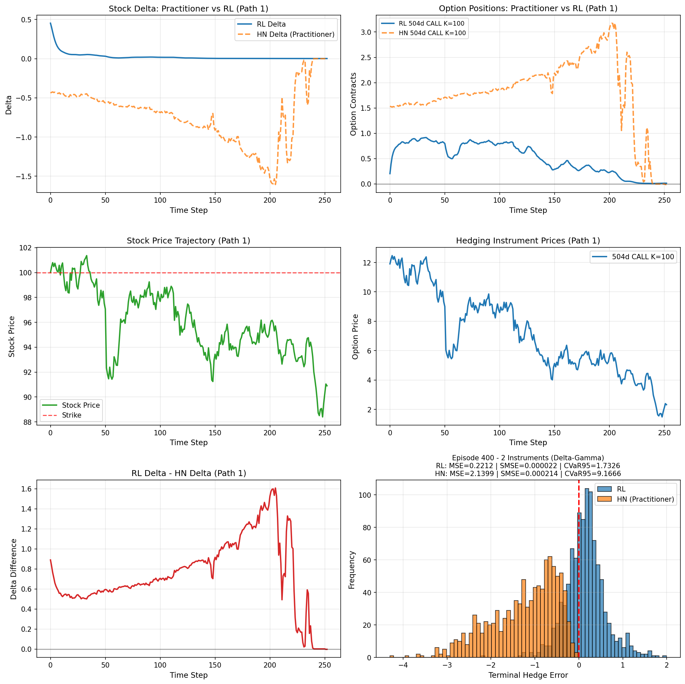
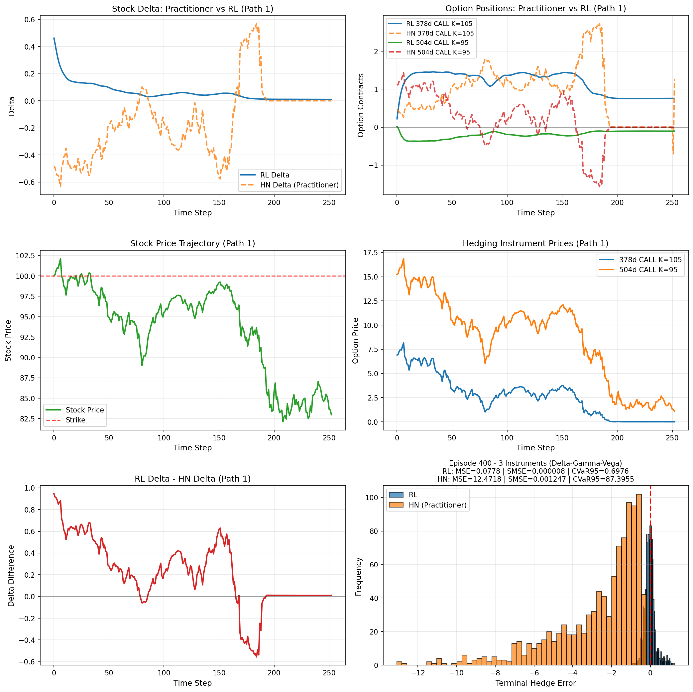

# Deep Hedging

A reinforcement learning framework for computing optimal dynamic hedging strategies on option portfolios. The agent learns to utilize a portfolio of stocks, bonds, and options at each time step to minimize Greek risk (delta, gamma, vega, theta) subjected to linear transaction costs.

The simulation scheme utilizes the GARCH(1,1) model under Heston-Nandi parameters (configurable). Option prices and Greeks are calculated under the Heston-Nandi framework.

## Installation

```bash
pip install torch numpy numba
```

## Quick Start

```bash
python train.py --config cfgs/<config_name>
```

## Project Structure

```
Deep-Hedging/
├── cfgs/                          # Configuration files
│   ├── configDTC.yaml             # Delta with transaction costs
│   ├── configDGTC.yaml            # Delta-Gamma with transaction costs
│   ├── configDGVTC.yaml           # Delta-Gamma-Vega with transaction costs
│   ├── configDGVTTC.yaml          # Delta-Gamma-Vega-Theta with transaction costs
│   ├── configBDTC.yaml            # Barrier: Delta with transaction costs
│   ├── configBDGTC.yaml           # Barrier: Delta-Gamma with transaction costs
│   └── ...                        # Additional configurations
│
├── models/                        # Pre-trained model weights
│   ├── barrier/                   # Barrier option models
│   ├── european/                  # European option models
│   └── miscellaneous/             # Alternative models
│
├── notebooks/                     # Jupyter notebooks and scripts
│   ├── deep_training.py
│   └── RLHNDGV.ipynb
│
├── scripts/                       # Utility scripts
│   ├── check_barrier_model.py
│   └── download_models.py
│
├── src/                           # Core source code
│   ├── agents/                    # RL policy networks
│   ├── option_greek/              # Option pricing and Greeks computation
│   ├── simulation/                # Hedging environment and dynamics
│   └── visualization/             # Result visualization
│
├── visual-results/                # Generated visualizations
│   ├── barrier/                   # Barrier option results
│   └── european/                  # European option results
│
├── derivative_factory.py          # Factory for derivative instruments
├── train.py                       # Main training script
└── setup.py                       # Package installation
```

## Configuration

Configuration files are provided in the `cfgs/` directory. The naming convention indicates the hedging strategy:

- **B** prefix indicates barrier options (absence indicates European options)
- **D** = Delta hedging
- **G** = Gamma hedging
- **V** = Vega hedging
- **T** = Theta hedging
- **TC** suffix = Transaction costs included
- **X** suffix = Extended configuration variant

Examples:
- `configDTC.yaml` — European option, Delta hedging, Transaction costs
- `configDGVTC.yaml` — European option, Delta-Gamma-Vega hedging, Transaction costs
- `configBDGTC.yaml` — Barrier option, Delta-Gamma hedging, Transaction costs

## Results

Visual comparisons of hedging performance across different Greek strategies:

### Delta Hedging


### Delta-Gamma Hedging


### Delta-Gamma-Vega Hedging


## Models

Pre-trained weights are available in `models/`:

- **european/** — Models trained with Heston-Nandi dynamics
- **barrier/** — Models for barrier options
  - **NoTC/** — Models without transaction costs
  - **TC/** — Models with transaction costs
- **miscellaneous/** — Alternative models

## License

This project is licensed under the terms specified in the LICENSE file.
